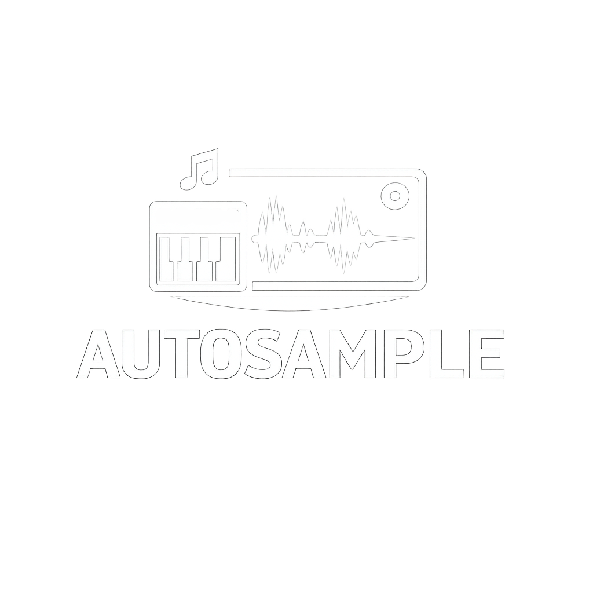
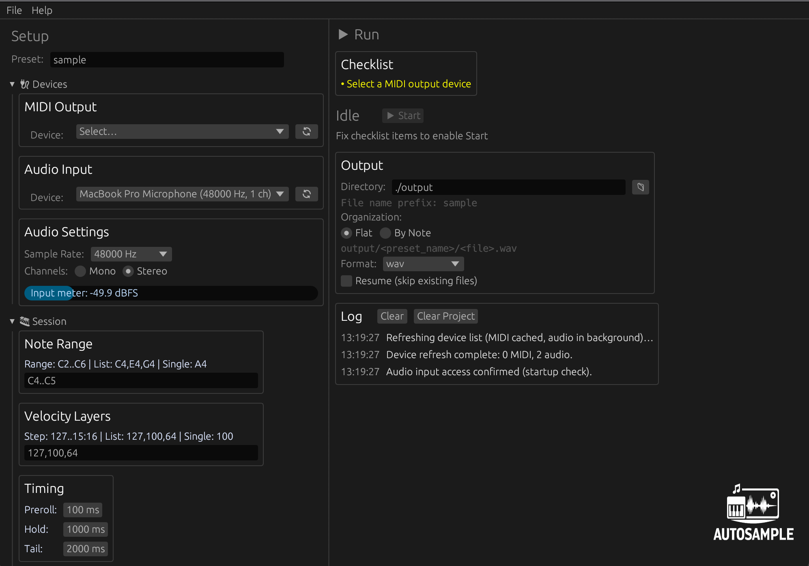

# Autosample - GUI + CLI

<p align="center">
  
</p>

A lightweight Rust autosampler for macOS, Windows, and Linux, focused on a desktop GUI workflow with a CLI also available. It triggers notes over MIDI, records audio input, and exports organized multisamples with metadata.

---

## Overview

Autosample helps you sample instruments quickly and consistently.
Pick your notes and velocity layers, record each one automatically, and get clean files ready to use in your sampler.

It gives you:

* Automatic MIDI note playback and recording
* Desktop GUI for setup, device selection, and session control
* Optional cleanup tools (trim and normalize)
* WAV or MP3 export
* Resume mode so long sessions are easy to continue

---

## Features

* **Note and Velocity Parsing:** Supports single values, lists, and ranges
* **Timing Control:** Independent preroll, hold, and tail durations
* **Round Robin:** Multiple takes per note/velocity
* **Output Organization:** Flat or by-note directory layout
* **Session Metadata:** Writes `session.json` for every run
* **Resume Mode:** Skips already existing target files
* **Cross-Platform:** macOS, Linux, and Windows

---

## Requirements

### Runtime

* A MIDI output target (like hardware synth)
* An audio input device
* ffmpeg (only required when exporting MP3 or `both`)

### Development / Build

* Rust toolchain (stable): https://rustup.rs/

---

## Installation

### 1. Clone

```bash
git clone https://github.com/ariel10aguero/autosample
cd autosample
```

### 2. Build

```bash
cargo build --release
```

Binary output:

```text
target/release/autosample
```

---

## Quick Start

### 1. List devices

```bash
./target/release/autosample list-midi
./target/release/autosample list-audio
```

### 2. Run a small test

```bash
./target/release/autosample run \
  --midi-out 0 \
  --audio-in 0 \
  --notes "C4" \
  --vel "127" \
  --output "./output" \
  --prefix "test"
```

---

## Usage Notes

### Notes syntax (`--notes`)

* Range: `C2..C6` (ascending only)
* List: `C4,E4,G4`
* Single: `A4`
* Accidentals in input: `C#4`, `Db4`

### Velocity syntax (`--vel`)

* Range with step: `127..15:16`
* List: `127,100,64`
* Single: `100`

### Timing model

Total recording time per sample:

```text
preroll_ms + hold_ms + tail_ms
```

---

## Output Layout

Autosample writes to:

```text
<output>/<prefix>/
```

With `--output-organization flat`:

```text
output/Piano/
  Piano_C4_vel127.wav
  Piano_Cs4_vel127.wav
  session.json
```

With `--output-organization by-note`:

```text
output/Piano/
  C4_060/
    Piano_C4_vel127.wav
  Cs4_061/
    Piano_Cs4_vel127.wav
  session.json
```

Accepted values:

* `flat`
* `by-note`

---

## Common Run Example

```bash
./target/release/autosample run \
  --midi-out "Your MIDI Device" \
  --audio-in "Your Audio Device" \
  --notes "C3..C6" \
  --vel "127,100,64,32" \
  --hold-ms 1000 \
  --tail-ms 2000 \
  --preroll-ms 100 \
  --round-robin 2 \
  --format wav \
  --output "./output" \
  --prefix "Piano" \
  --output-organization by-note \
  --resume
```

---

## Troubleshooting

* **MIDI device not found:** Verify with `list-midi` and use exact name/index
* **Audio device not found:** Verify with `list-audio` and use exact name/index
* **Attack is cut:** Increase `--preroll-ms`
* **Release is cut:** Increase `--tail-ms`
* **Low level output:** Use `--normalize peak`
* **Interrupted session:** Re-run with `--resume`

---

## GUI Screenshot


